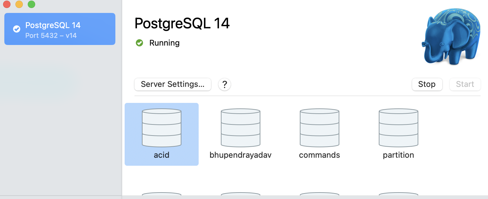
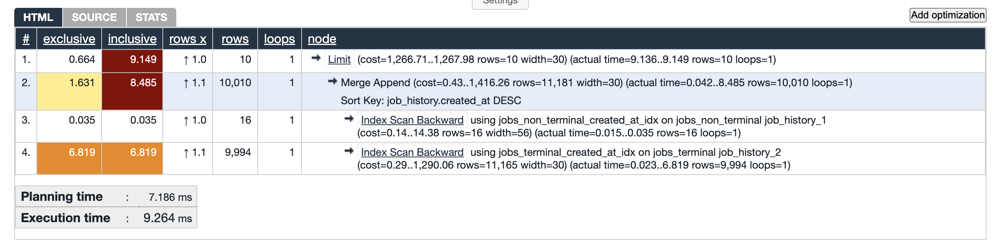
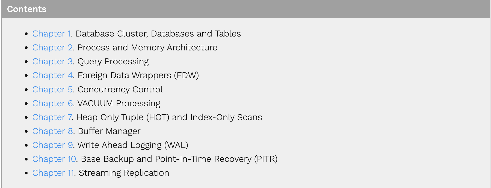

If you are working with PostgreSQL in your day to day work, this article is for you. Keep reading :)

I wanted to share some tools, articles that help you improve your understanding
and working with PostgreSQL.

## # Tools

### PgCli
This is similar to `psql` but with better `syntax highlighting and auto completions`.

Github link: <a href="https://github.com/dbcli/pgcli" target="_blank">click here</a>.

### Postgres App (Only for MAC)
This is the easiest way to spin up multiple PostgreSQL servers on your local. It's a single click start and stop for Postgres.

Official Website: <a href="https://postgresapp.com/" target="_blank">click here</a>.

### Visualize your query plan
If you are debugging slow queries, the first thing you will do is to get a query plan with `EXPLAIN ANALYZE`, but
its output is not very intuitive to read when there are multiple joins.

In such cases, I often go to <a href="https://explain.depesz.com/" target="_blank">depesz.com</a> to paste my query plan and get better 
syntax highlighting, table structure format for each group to easily understand the query plan. I have used it for understanding the bottlenecks in a query that had 6+ joins and the plan was 400+ lines long.

Generally, I have found that when you google things e.g. "postgres query plan visualizer online", often the results are not the best websites that do the job, but the ones that have the best SEO (Search Engine Optimization). So, I bookmark these websites which may not even appear on Google search results' first page.

### PostgREST
Use REST API's to access your PG database. 
Though it has it's own syntax, but it's super easy to get started with it and you can [quickly grasp](https://docs.postgrest.org/en/v12/references/api/tables_views.html#get-and-head) the syntax in few minutes going through the doc.

`Fun Fact`: <a href="https://supabase.com/" target="_blank">Supabase</a> uses it under the hood.

Github link: <a href="https://github.com/PostgREST/postgrest" target="_blank">click here</a>.

## # Interesting Reads
If you are looking to improve your understanding about Postgres, here are some great articles.

ps: If you google the topics of these articles, it's almost unlikely that the links I am sharing below will appear in the top results page (same SEO reason), but they are worth the read compared to the top Google results in my opinion. The top Google results are usually the same basic ones from websites like Tutorials Point, FreeCodeCamp, JavaTpoint, etc.

### Understanding Indexes in Postgres
This is an interesting series on the Postgres Pro website about Indexes.
Of course, you don't need to read all parts—just go through the ones that are required for your use case. If you are a beginner, you can go through the first 4 parts at least.

- <a href="https://postgrespro.com/blog/pgsql/3994098" target="_blank">part 1</a>. Introduction to Indexes.
- <a href="https://postgrespro.com/blog/pgsql/4161264" target="_blank">part 2</a>. Extension on part 1.
- <a href="https://postgrespro.com/blog/pgsql/4161321" target="_blank">part 3</a>. Hash Indexes.
- <a href="https://postgrespro.com/blog/pgsql/4161516" target="_blank">part 4</a>. Btree Indexes.
- <a href="https://postgrespro.com/blog/pgsql/4175817" target="_blank">part 5</a>. GiST generalized search tree index.
- <a href="https://postgrespro.com/blog/pgsql/4220639" target="_blank">part 6</a>. SP GiST.
- <a href="https://postgrespro.com/blog/pgsql/4261647" target="_blank">part 7</a>. GIN Generalized Inverted Index for Full Text Search etc.
- <a href="https://postgrespro.com/blog/pgsql/4262305" target="_blank">part 8</a>. RUM (Rapid Unlogged Multicolumn).
- <a href="https://postgrespro.com/blog/pgsql/5967830" target="_blank">part 9</a>. BRIN (Block Range Index).
- <a href="https://postgrespro.com/blog/pgsql/5967832" target="_blank">part 10</a>. BLOOM (based on bloom filters).

### Postgres Internals
If you are curious to go a bit deeper and understand Postgres internals, then head over to <a href="https://www.interdb.jp/pg/" target="_blank">Interdbjp</a>.

Table of contents:

TBH, I went through few chapters of my interest and didn't fully understand a lot of things. But it did help me understanding some fundaments. Over time, as my understanding improves I will re-read them to fully grasp it.