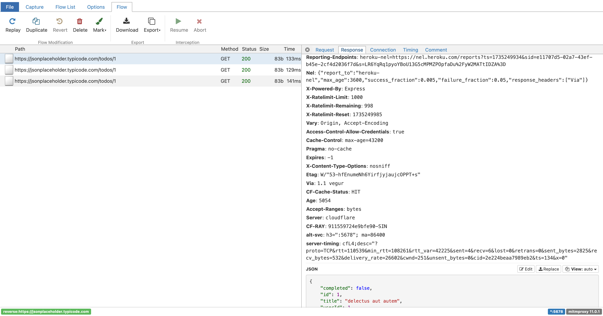

In this blog post, I want to share how I use Mitm Proxy for my daily development.  
I mostly use it to intercept and inspect HTTP requests for local testing and debugging.

### Problem Statement  

Let's say you are working on a codebase where your frontend calls the backend to fetch data and render the UI.  

What are the ways you can figure out what HTTP calls your frontend is making to your backend?  
You can inspect HTTP calls in the browser DevTools network tab, but that becomes cumbersome when inspecting a lot of requests, right? Or you could log the requests.  

We can do better. What if you route all your requests through a middleman that sees all requests and displays them in a UI? That middleman is **Mitm Proxy**.  

### Using Mitm Proxy  

Say your backend is running on `http://localhost:9000`, and your frontend is pointing to this backend URL.  

You can start a **Mitm reverse proxy** on a new port and forward all requests to your backend:  

```shell
mitmweb -p 5678 --mode reverse:http://localhost:9000
```

This command starts a new server on port `5678`, forwarding all requests to your backend (`port 9000`).  
It also provides a UI at `http://localhost:8081`, where you can inspect all requests (including request body, URL, headers, and responses) in your browser.  

Now, update your frontend configuration to use the proxy endpoint: `localhost:5678` as your backend URL.


### Other Use Cases  

There are many ways to use Mitm Proxy.  
For example, if your application makes calls to a third-party service (e.g., Okta, Zendesk, etc.), and you want to inspect the exact HTTP requests it makes, you can start a reverse proxy like this:

```shell
mitmweb -p 5678 --mode reverse:https://my-third-party.service.com
```

Then, change your service configuration to point the third-party service endpoint to Mitm Proxy:
`third_party_svc_endpoint: http://localhost:5678`

### Additional Features
I've only touched the surface—Mitm Proxy also supports other protocols like TCP, WebSockets, and DNS.
If you want to inspect HTTPS traffic, you can install the Mitm certificate. Follow this video [tutotial](https://youtu.be/S-5Sx561jnk?t=136).
