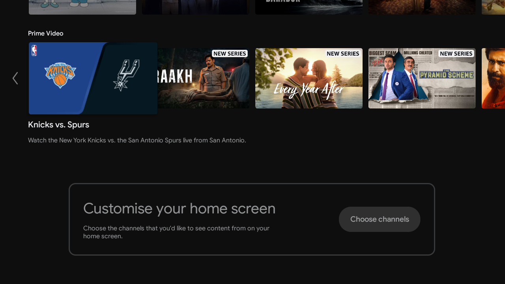
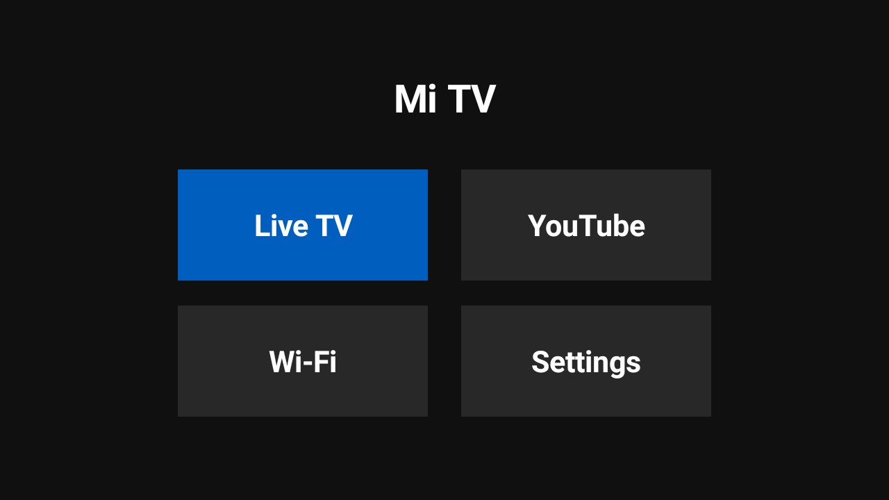

My Mi TV had become painfully slow.

I use it for exactly two things:

1. Watching YouTube over Wi-Fi.
2. Watching Free Dish / Live TV.

That is it. I do not need PatchWall, Prime Video rows, random recommendations, JioHotstar cards, Xiaomi TV+ content, auto-installed apps, or a home screen that behaves like a billboard.

So I decided to clean it up with `adb`.

One fun detail: I did not do this manually by typing every command myself.
This whole cleanup, package inspection, launcher build, install, and verification flow was done through Codex CLI using the 5.5 medium model, with `adb` commands executed from the terminal.

### Prerequisites

Before doing any of this, Developer options must be enabled on the TV.

You will need:

1. A laptop with `adb` installed.
2. The TV and laptop on the same Wi-Fi network.
3. Developer options enabled on the TV.
4. USB debugging / network debugging enabled.
5. The TV's IP address.

If you have not enabled Developer options on Android TV before, watch this video first:
[How to enable Developer options on Android TV](https://www.youtube.com/watch?v=qcpl8SzWzb8).

After enabling debugging, the TV should show an authorization prompt the first time your laptop connects. Accept it, and select the option to always allow from this computer if you trust the machine.

### Safety Notes

Do not leave debugging enabled forever.

ADB over the local network is convenient, but it also means the TV is listening for debug connections on your LAN. That is fine for a short maintenance session on a trusted home network, but it should not be treated as a permanent setting.

After you finish:

```shell
adb disconnect 192.168.0.100:5555
```

Then go back to the TV and turn off USB debugging / network debugging from Developer options.

I also recommend keeping the recovery commands from this post somewhere accessible before disabling the stock launcher. If the custom launcher ever breaks, reconnect with `adb` and restore the Google TV launcher.

### Connecting to the TV

First, I connected to the TV over the local network:

```shell
adb connect 192.168.0.100:5555
adb devices -l
```

The TV showed up as a MiTV4I running Android 9:

```text
192.168.0.100:5555     device product:magnolia model:MiTV4I device:magnolia
```

If it shows as `unauthorized`, accept the debugging prompt on the TV. I also selected the "always allow from this computer" option so I would not have to approve it again.

### Package Inventory

Before removing anything, I listed installed packages:

```shell
adb shell pm list packages -f
```

This part matters. Android TV has a lot of packages that look useless but are actually tied to input sources, tuner support, settings, Play Services, or the launcher. Removing random packages is a good way to make the TV worse.

For my use case, these packages were important to keep:

```text
com.google.android.youtube.tv
com.google.android.gms
com.google.android.gsf
com.android.tv.settings
com.android.providers.settings
com.android.systemui
com.android.tv
com.android.providers.tv
com.droidlogic.tvinput
com.droidlogic.droidlivetv
com.droidlogic.tv.settings
```

Since my Free Dish setup uses the round coax cable, I also avoided touching the tuner and Live TV stack.

### Safe First Pass

I started with apps and services that were not needed for YouTube or Live TV.

The command I used was `pm uninstall --user 0`, which removes the package for the current user without modifying the system partition:

```shell
adb shell pm uninstall --user 0 com.amazon.amazonvideo.livingroom
adb shell pm uninstall --user 0 com.google.android.play.games
adb shell pm uninstall --user 0 com.google.android.youtube.tvmusic
adb shell pm uninstall --user 0 com.google.android.videos
adb shell pm uninstall --user 0 com.google.android.backdrop
adb shell pm uninstall --user 0 com.xiaomi.mimusic2
adb shell pm uninstall --user 0 com.mitv.gallery
adb shell pm uninstall --user 0 com.mitv.videoplayer
adb shell pm uninstall --user 0 com.xiaomi.mitv.mediaexplorer
adb shell pm uninstall --user 0 org.chromium.webview_shell
adb shell pm uninstall --user 0 com.android.gallery3d
adb shell pm uninstall --user 0 com.android.printspooler
adb shell pm uninstall --user 0 com.android.providers.calendar
adb shell pm uninstall --user 0 com.android.camera2
adb shell pm uninstall --user 0 com.android.smspush
```

After that, YouTube and Live TV were still installed:

```shell
adb shell pm list packages | grep -E 'youtube.tv|com.android.tv|droidlogic'
```

### The Home Screen Problem

Even after removing apps, the home screen still showed recommendation rows.



I removed and disabled some obvious sources:

```shell
adb shell pm uninstall --user 0 com.mitv.tvhome.mitvplus
adb shell pm uninstall --user 0 com.xm.webcontent
adb shell pm uninstall --user 0 com.mitv.tvhome.atv
adb shell pm disable-user --user 0 com.google.android.tvrecommendations
adb shell pm disable-user --user 0 com.google.android.leanbacklauncher.recommendations
adb shell pm disable-user --user 0 com.xiaomi.mitv.tvmanager
adb shell pm disable-user --user 0 com.android.vending
```

The visible app list became clean:

```text
YouTube
Live TV
```

But the Google TV launcher still showed content rows and sponsored recommendations.

At that point it was clear that the launcher itself was the problem. It could still render its own feed, even when most of the apps behind those rows were removed.

### The Real Fix: A Minimal Launcher

The better fix was to replace the home screen with a small launcher.

The launcher only needed four buttons:

```text
Live TV
YouTube
Wi-Fi
Settings
```

I built a tiny Android launcher app that registers as a `HOME` activity. The buttons launch:

```text
Live TV  -> com.android.tv/.TvActivity
YouTube  -> com.google.android.youtube.tv
Wi-Fi    -> android.settings.WIFI_SETTINGS
Settings -> android.settings.SETTINGS
```

One important detail: the APK must declare a sane `targetSdkVersion`. My first build did not, and Android showed the warning:

```text
This app was built for an older version of Android and may not work properly
```

Since this Mi TV runs Android 9, I rebuilt the launcher with:

```xml
<uses-sdk
    android:minSdkVersion="23"
    android:targetSdkVersion="28" />
```

After installing the launcher, I disabled the stock Google TV launcher:

```shell
adb shell pm disable-user --user 0 com.google.android.tvlauncher
adb shell cmd package set-home-activity io.codex.simpletvlauncher/.MainActivity
adb shell input keyevent HOME
```

Now pressing Home opens a plain screen with only four options: Live TV, YouTube, Wi-Fi, and Settings.

No recommendations. No ads. No content rows.



### Recovery Commands

This is the important part. Always keep a recovery path.

To restore the stock launcher and Play Store:

```shell
adb shell pm enable com.google.android.tvlauncher
adb shell pm enable com.android.vending
adb shell cmd package set-home-activity com.google.android.tvlauncher/.MainActivity
adb shell pm uninstall io.codex.simpletvlauncher
```

To restore one of the removed system packages:

```shell
adb shell cmd package install-existing --user 0 <package-name>
```

For example:

```shell
adb shell cmd package install-existing --user 0 com.amazon.amazonvideo.livingroom
```

### Final State

The TV now does exactly what I want:

1. Press Home.
2. Choose Live TV or YouTube.
3. Use Wi-Fi or Settings only when needed.

It feels faster mainly because the home screen is no longer doing a hundred things I never asked it to do.

This is the kind of "smart TV" I actually want: a screen, a tuner, YouTube, and no nonsense.
