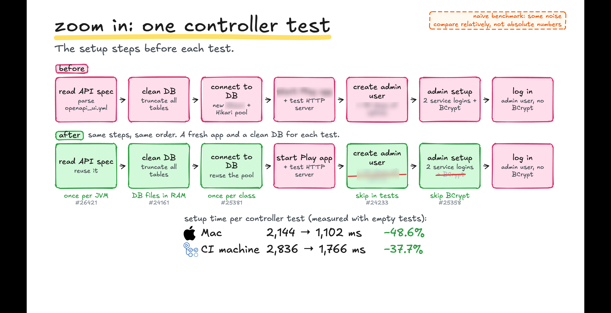
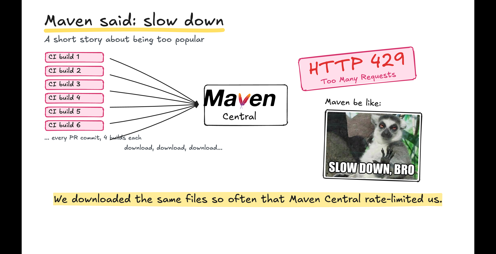
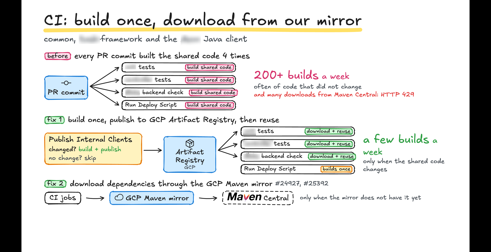

I wanted less waiting between a code change and its CI result. I found repeated work in two places: test setup and shared library builds.

**CI got faster when I stopped repeating work.**

### Making test setup faster

The suite had about **2,800 tests in total**. They ran in **four separate Java processes** (JVM forks) in parallel.

These were full application tests that called the actual HTTP server. Before each test, I truncated the Postgres tables and started the application. Other setup included user creation, generated account history, and service logins.

On a dev server with the same specs as CI, setup alone took **2.8 seconds per test**:

```java
@BeforeEach // About 2.8 seconds on the dev server, before test logic.
void setup() {
    // Truncate tables, start the application, and prepare test data.
}

@Test
void test1() {
    // Call the actual HTTP server and assert the result.
}
```

I instrumented the initialization code to see **where those 2.8 seconds went**. I used a single class with ten empty tests. Each test ran setup through `@BeforeEach`.

Five areas stood out:

- **Spec parsing:** Each test parsed the same spec. I parsed it once per Java process and reused the result.
- **Connection pool:** Each test created a new pool and destroyed it afterward. Each new Postgres connection starts a [new server process](https://www.postgresql.org/docs/17/tutorial-arch.html), which adds cost. I reused one pool per test class.[^connections]
- **Database cleanup:** Each test ran `TRUNCATE` on the Postgres tables. I put the Postgres data directory on `tmpfs`, a RAM disk, to make this faster.
- **Generated history:** User creation generated account history that these tests did not need. I removed it from the setup.
- **Password checks:** Service logins ran `BCrypt` checks during setup. I bypassed them in these tests.[^passwords]

Why not start the application once for all tests? I wanted each test to start from a known state, regardless of test order. I kept a fresh application and truncated tables for each test.



The median of three benchmark runs showed these initialization times:

| Machine                      | Before   | After    | Reduction |
| ---------------------------- | -------: | -------: | --------: |
| Mac                          | 2,144 ms | 1,102 ms |     48.6% |
| Dev server (same specs as CI) | 2,836 ms | 1,766 ms |     37.7% |

That saved about **one second per test**. With 700 tests per fork, that would mean about **12 minutes less setup per fork**.[^measurements]

### Building shared code once

Four CI jobs built shared Java libraries **independently** for each pull request commit, even when those libraries did not change.

Each job also downloaded dependencies from Maven Central, the public Java package server. Repeated downloads hit its rate limit: `HTTP 429`, or "too many requests."



I moved shared library builds into a job that published the built library files when the code changed. **Three jobs now downloaded those files** instead of compiling the libraries again.[^versions] The deployment job kept its own build.

For downloads, I used **Google Cloud Artifact Registry** as an internal managed Maven proxy. It [downloads and caches each package version on its first request](https://docs.cloud.google.com/artifact-registry/docs/repositories/remote-overview#how-remote-repositories-work). Later requests receive the cached copy.



I also made some service checks conditional on changed files. Those rules include changes to shared libraries and build configuration.

**Before making a step faster, check whether it needs to run again.**

[^connections]: A reused connection must not retain an open transaction from the previous test.
[^passwords]: Tests for password authentication must still run the application's password check.
[^measurements]: These benchmarks measure initialization only. The 12-minute estimate assumes 700 tests per fork. I do not have comparable full CI timings before and after these changes.
[^versions]: The built files must match the source version, dependency versions, and build configuration. Old files can make a build check the wrong code.
